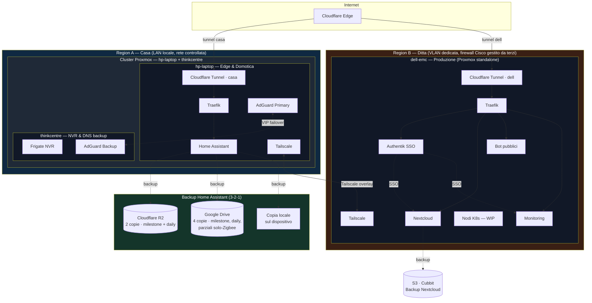

---
aliases:
  - Homelab
  - Home
tags:
  - homelab
  - overview
---

# Homelab

> Documentazione e Infrastructure-as-Code del mio homelab personale: automazione domestica, servizi self-hosted, sperimentazione Kubernetes.

[]()
[]()
[]()
[]()

---

## Indice

- [Panoramica](#panoramica)
- [Hardware](#hardware)
- [Architettura](#architettura)
  - [Due region](#due-region-due-esposizioni-indipendenti)
  - [Interconnessione tra i siti](#interconnessione-tra-i-siti)
  - [DNS ad alta disponibilità](#dns-ad-alta-disponibilità)
  - [Backup di Home Assistant](#backup-di-home-assistant)
- [Stack tecnologico](#stack-tecnologico)
- [Struttura del repository](#struttura-del-repository)
- [Repository come Obsidian vault](#repository-come-obsidian-vault)
- [Decisioni architetturali](#decisioni-architetturali-adr)
- [Secret management](#secret-management)
- [Roadmap](#roadmap)

---

## Panoramica

Questo repository documenta e — dove possibile — **definisce come codice** l'intero homelab: 3 nodi Proxmox, automazione domestica basata su Home Assistant, networking con Tailscale e Cloudflare Tunnel, servizi self-hosted in produzione (Nextcloud, Authentik, monitoring) e un cluster Kubernetes in fase di sperimentazione.

L'obiettivo del repo non è solo mostrare delle configurazioni, ma raccontare **il perché** delle scelte fatte: ogni decisione architetturale rilevante è documentata come [ADR](#decisioni-architetturali-adr).

## Hardware

| Nodo | Sito | CPU | Ruolo |
|---|---|---|---|
| **dell-emc** | Ditta | 16 × Intel Xeon Silver 4110 @ 2.10GHz | Nodo principale: servizi in produzione, sperimentazione, k8s (WIP) |
| **hp-laptop** | Casa | 4 × Intel Core i5-6200U @ 2.30GHz | Hub domotico + edge: sempre acceso, basso consumo, networking |
| **thinkcentre** | Casa | 4 × Intel Core i3-4130 @ 3.40GHz | Videosorveglianza (Frigate) + failover DNS |

Tutti e 3 i nodi eseguono **Proxmox VE**: `hp-laptop` e `thinkcentre` in **cluster** sulla LAN di casa, `dell-emc` **standalone** nel sito remoto. Dettagli sulla topologia multi-sito in [ADR-005](docs/adr/005-topologia-multi-sito.md).

## Architettura

L'homelab è distribuito su **due siti fisici distinti** (*region*), collegati tra loro da Tailscale:



### Due region, due esposizioni indipendenti

Ogni sito ha il proprio Cloudflare Tunnel e il proprio Traefik, così i due domini di guasto restano separati: un problema in un sito non tocca l'esposizione dell'altro.

- **Region A — Casa:** `hp-laptop` + `thinkcentre` sono un **cluster Proxmox** sulla stessa LAN. Il tunnel Cloudflare di casa fronta Home Assistant e gli altri servizi locali via Traefik su `hp-laptop`. Nessuna porta esposta sul router di casa.
- **Region B — Ditta:** `dell-emc` è un nodo **Proxmox standalone** ospitato presso l'azienda di famiglia, su una **VLAN dedicata dietro un firewall Cisco gestito e supervisionato da terzi**. Ha un Cloudflare Tunnel ad-hoc e un Traefik proprio per i servizi di produzione (Authentik, Nextcloud, bot, monitoring, PACA — quest'ultimo su una LXC dedicata, vedi [ADR-009](docs/adr/009-paca.md)).

### Interconnessione tra i siti

Un overlay **Tailscale** collega `hp-laptop` (Region A) e `dell-emc` (Region B) — è la rete di gestione cross-site e il canale per i servizi non pensati per l'esposizione pubblica. `thinkcentre` non ha un nodo Tailscale: resta raggiungibile solo dentro la LAN di casa.

> La Region B gira su un'infrastruttura di rete **non sotto il mio controllo diretto** (firewall e VLAN gestiti dall'azienda che amministra l'infra aziendale). È un vincolo reale che ha guidato diverse scelte — tunnel in uscita invece di port forwarding, nessuna dipendenza da regole firewall che non controllo. Approfondito in [ADR-005](docs/adr/005-topologia-multi-sito.md).

### DNS ad alta disponibilità

AdGuard Home gira in coppia primario/backup (`hp-laptop` / `thinkcentre`) con IP virtuale condiviso, interamente dentro la LAN di casa — il failover VRRP sfrutta la stessa rete fisica. Dettagli in [ADR-001](docs/adr/001-adguard-ha-failover.md).

### Backup di Home Assistant

Essendo il componente di punta dell'homelab, l'hub domotico è ridondato più di ogni altro servizio, con una logica **3-2-1** su destinazioni multiple — **Cloudflare R2** (2 copie: una *milestone* e una giornaliera), **Google Drive** (4 copie: milestone, alcune giornaliere e copie parziali del solo database Zigbee) e una **copia locale** sul dispositivo. Backup completi *milestone* per i ripristini importanti, giornalieri per il recupero rapido, parziali Zigbee per rimettere in piedi in fretta la sola rete dei dispositivi.

> [!NOTE] Perché sparpagliati su più servizi?
> Diciamocelo francamente: distribuire le copie su provider diversi serve anche a **spremere i piani gratuiti** di ciascuno. Cloudflare R2 non fa pagare l'egress, Google Drive regala qualche giga — spalmare i backup tiene la bolletta a zero e, come effetto collaterale niente male, aggiunge *vera* ridondanza tra fornitori indipendenti. Taccagneria e resilienza che per una volta vanno d'accordo. 


## Stack tecnologico

| Area | Strumento |
|---|---|
| Virtualizzazione | Proxmox VE |
| Provisioning | OpenTofu (provider `bpg/proxmox`) |
| Configuration management | Ansible |
| Servizi | Docker Compose, tracciato direttamente in `docker-compose/` ([ADR-008](docs/adr/008-docker-compose-management.md)) |
| Aggiornamenti automatici | Renovate self-hosted (minor/patch in automerge, major delle immagini stateful dietro approvazione manuale) + timer systemd per il deploy ([ADR-008](docs/adr/008-docker-compose-management.md)) |
| Orchestrazione (WIP) | Kubernetes + Flux CD |
| Reverse proxy | Traefik |
| Esposizione pubblica | Cloudflare Tunnel |
| VPN / overlay network | Tailscale |
| DNS / ad-blocking | AdGuard Home (HA con Keepalived + [adguardhome-sync](https://github.com/bakito/adguardhome-sync)) |
| Identity / SSO | Authentik |
| Storage / file sync | Nextcloud (backup su S3 Cubbit) |
| Videosorveglianza | Frigate |
| Domotica | Home Assistant |
| Secret management | 1Password (Connect + Service Accounts) per i segreti infrastrutturali; Infisical self-hosted per gli `.env` applicativi |
| Documentazione | MkDocs Material + GitHub Pages |
| CI | GitHub Actions |

## Struttura del repository

```
homelab/
├── renovate.json              # config Renovate (ADR-008)
├── docs/                      # documentazione estesa (MkDocs)
│   └── adr/                   # Architecture Decision Records
├── infrastructure/             # ansible/+opentofu/, tracciata direttamente come
│   │                           # docker-compose/ (ADR-008) — stesso path usato
│   │                           # per l'esecuzione reale su pve-management.
│   ├── opentofu/               # provisioning VM/LXC su Proxmox
│   │   └── nodes/{dell-emc,hp-laptop,thinkcentre}/
│   └── ansible/                # configurazione OS e deploy
├── scripts/                   # gitleaks hook, timer di deploy automatico (ADR-008)
├── .claude/skills/             # skill per scaffoldare nuovi servizi già sanitizzati
├── docker-compose/             # docker-compose per ogni stack — stesso nome/path
│   │                           # dei nodi reali, tracciata direttamente (ADR-008).
│   │                           # Reali oggi: 1password-connect, infisical, linkwarden,
│   │                           # monitoring, traefik, hawser, Semaphore, renovate.
│   ├── traefik/
│   ├── adguard/                # non ancora versionato (Region A)
│   ├── frigate/                # non ancora versionato (Region A)
│   ├── nextcloud/               # non ancora versionato
│   ├── authentik/               # non ancora versionato
│   └── monitoring/
├── kubernetes/                # manifest / Flux (WIP)
├── home-assistant/            # configurazione domotica
└── .github/workflows/         # CI: lint, validate, deploy docs (ancora da impostare)
```

## Repository come Obsidian vault

Questo repository è pensato per vivere in due posti contemporaneamente: come **repo pubblico su GitHub** e come **vault [Obsidian](https://obsidian.md/)** aperto in locale. Uso Obsidian quotidianamente per gestire la mia knowledge base, e questa documentazione nasce lì — la struttura del repo lo rispecchia di proposito.

Per far convivere i due mondi ho scelto un approccio **dual-compatible**, senza rompere il rendering di nessuno dei due:

- **Link markdown relativi** (`[testo](percorso.md)`), non wikilink `[[ ]]`. Motivo: i wikilink funzionano in Obsidian ma su github verrebbero mostrati come testo grezzo. I link markdown relativi invece sono cliccabili su GitHub **e** popolano comunque il *graph view* di Obsidian (con `alwaysUpdateLinks` attivo, Obsidian li aggiorna da solo sui rename).
- **Callout / alert** in sintassi `> [!NOTE]`, `> [!WARNING]`: identica per i [callout di Obsidian](https://help.obsidian.md/callouts) e per gli [alert di GitHub](https://docs.github.com/get-started/writing-on-github/getting-started-with-writing-and-formatting-on-github/basic-writing-and-formatting-syntax#alerts). GitHub vuole la keyword in maiuscolo, Obsidian accetta entrambi: uso il maiuscolo così un solo blocco è reso bene su entrambi.
- **Frontmatter YAML** (properties) e **tag** (`#adr`, `#region/casa`, `#service/adguard`) per navigare le note dal graph e dai filtri di Obsidian; su GitHub il frontmatter è reso come tabella, i tag come testo.
- **Diagrammi Mermaid**, supportati nativamente sia da GitHub sia da Obsidian.

> [!NOTE]
> La cartella di configurazione `.obsidian/` **non è versionata** (è in `.gitignore`). Contiene stato UI machine-specific, bundle di plugin e temi di terze parti e file di settings per-account che possono includere identificatori o token. Chi clona il repo lo apre come vault con la propria configurazione: la scelta di quali plugin usare resta personale, il contenuto delle note no.

## Decisioni architetturali (ADR)

Ogni scelta non banale è documentata nel formato *Contesto → Decisione → Conseguenze* in [`docs/adr/`](docs/adr/):

- [ADR-000](docs/adr/000-metodologia-ai.md) — Metodologia di lavoro e uso di strumenti AI
- [ADR-001](docs/adr/001-adguard-ha-failover.md) — DNS ad alta disponibilità con IP virtuale condiviso
- [ADR-002](docs/adr/002-cloudflare-tunnel.md) — Esposizione pubblica con Cloudflare Tunnel
- [ADR-005](docs/adr/005-topologia-multi-sito.md) — Topologia multi-sito (2 region) e separazione dei ruoli tra i nodi
- [ADR-006](docs/adr/006-1password-connect.md) — Secret management con 1Password Connect
- [ADR-007](docs/adr/007-infisical-env-management.md) — Gestione delle variabili d'ambiente con Infisical
- [ADR-008](docs/adr/008-docker-compose-management.md) — Versionamento docker-compose, aggiornamenti automatici (Renovate), deploy automatico
- [ADR-009](docs/adr/009-paca.md) — PACA su LXC dedicata, per isolare il rischio `docker.sock` di `agent-runner`

Decisioni già prese ma non ancora scritte per esteso (in programmazione):

- ADR-003 — SSO centralizzato con Authentik
- ADR-004 — Strategia di backup 3-2-1 su S3 Cubbit

## Secret management

Nessun segreto in chiaro nel repository. I file committati contengono solo **riferimenti** (`op://vault/item/field`) risolti a runtime tramite [1Password CLI](https://developer.1password.com/docs/cli/) e **1Password Connect**, self-hosted su `dell-emc`; i segreti applicativi dei servizi Docker Compose vivono invece su **Infisical**, self-hosted ([ADR-007](docs/adr/007-infisical-env-management.md)). Dettagli architetturali e limiti noti in [ADR-006](docs/adr/006-1password-connect.md).

Protezione aggiuntiva: **gitleaks** come pre-commit hook (repo locale e checkout su `pve-management`) — rete di sicurezza, non la difesa primaria. CI su GitHub Actions ancora da impostare.

## Roadmap

- [x] Documentazione architetturale e ADR (000, 001, 002, 005, 006, 007, 008 — 003/004 in programmazione)
- [x] OpenTofu + Ansible per provisioning e setup base dei container LXC su `dell-emc` (`Docker-100`, `Traefik-110` — `hp-laptop`/`thinkcentre` ancora da fare)
- [x] Migrazione secret management su 1Password Connect + Infisical, in produzione
- [x] Docker Compose versionato e sanitizzato per i servizi di `dell-emc`, aggiornamenti automatici con Renovate, deploy automatico via timer systemd ([ADR-008](docs/adr/008-docker-compose-management.md)) — Region A ancora da versionare
- [ ] CI reale su GitHub Actions (gitleaks già attivo solo come pre-commit hook locale)
- [ ] Sito di documentazione pubblicato (MkDocs Material + GitHub Pages)
- [ ] Cluster Kubernetes gestito in GitOps con Flux CD
- [ ] Sito di documentazione pubblicato su GitHub Pages

---

*Questo repository ha scopo di portfolio tecnico. Domini, IP, chiavi e identificativi reali sono sanitizzati o gestiti tramite secret manager esterno.*
