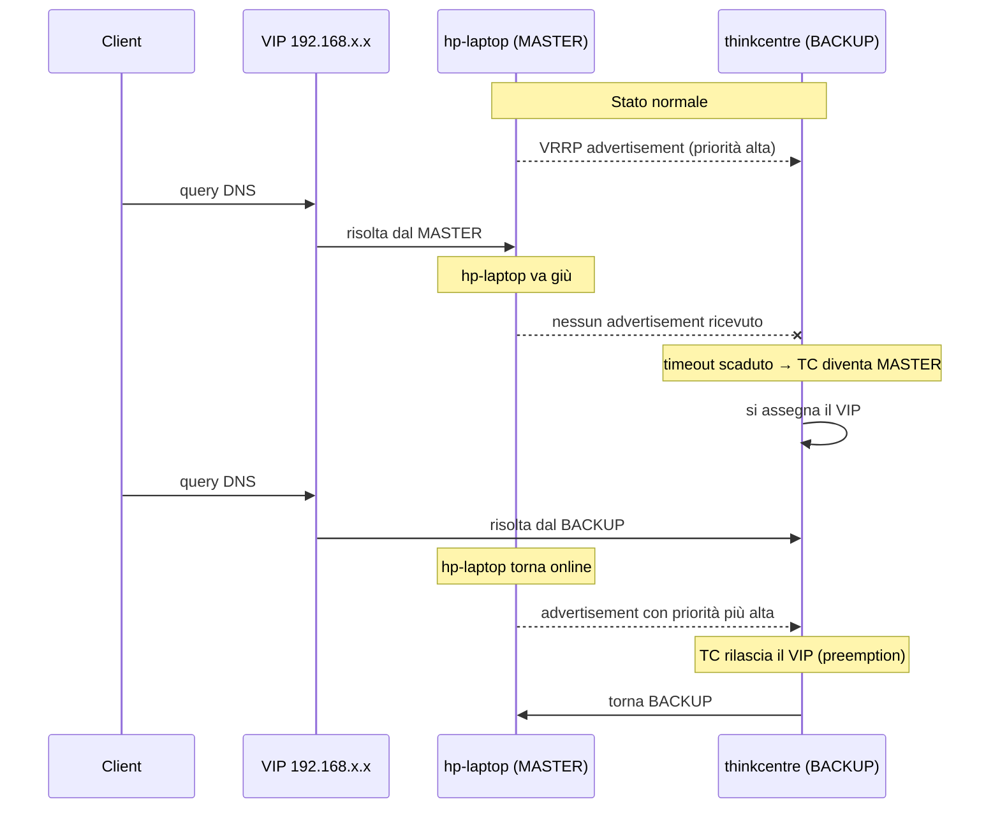

---
aliases:
  - ADR-001
  - DNS HA
  - Keepalived VRRP
tags:
  - adr
  - dns
  - alta-disponibilità
  - region/casa
  - service/adguard
status: accettato
date: 2026
related:
  - "[[005-topologia-multi-sito]]"
---

# ADR-001: DNS ad alta disponibilità con IP virtuale condiviso (Keepalived/VRRP)

| | |
|---|---|
| **Stato** | ✅ Accettato — in produzione |
| **Data** | 2026 |
| **Nodi coinvolti** | `hp-laptop` (primario), `thinkcentre` (backup) |

## Contesto

Il DNS è un single point of failure classico in qualunque rete domestica: se il resolver cade, ogni dispositivo che dipende da lui (client, automazioni Home Assistant, servizi che risolvono nomi interni) smette di funzionare, anche se la rete fisica è perfettamente funzionante.

Nel mio homelab AdGuard Home svolge un doppio ruolo — ad-blocking e resolver DNS per tutta la rete domestica — e gira su `hp-laptop`, lo stesso nodo che ospita l'hub domotico, Traefik e Tailscale. Un riavvio, un aggiornamento del sistema, o un guasto del portatile avrebbero significato: niente DNS in tutta casa.

Serviva una soluzione che:

- non richiedesse riconfigurazione manuale dei client (router, dispositivi IoT, VM) in caso di guasto;
- fosse trasparente: i client puntano sempre allo stesso IP, indipendentemente da quale nodo risponde davvero;
- avesse un tempo di failover breve, senza intervento umano;
- non introducesse un single point of failure *aggiuntivo* (es. un load balancer terzo da mantenere).

## Decisione

Ho scelto **Keepalived con protocollo VRRP** per gestire un **IP virtuale (VIP)** condiviso tra due istanze indipendenti di AdGuard Home:

- **`hp-laptop`** → istanza primaria, priorità VRRP più alta
- **`thinkcentre`** → istanza di backup, priorità più bassa, sempre in ascolto sulla rete locale

Il VIP (es. `192.168.x.x`) è l'unico indirizzo DNS configurato su router e client. Keepalived, su entrambi i nodi, si scambia pacchetti VRRP in multicast per determinare chi è il "master" in un dato momento:

- finché `hp-laptop` risponde ai controlli di Keepalived, tiene il VIP e serve le query DNS;
- se `hp-laptop` smette di rispondere (riavvio, crash del servizio, manutenzione), `thinkcentre` rileva l'assenza dei pacchetti VRRP entro pochi secondi e si assegna il VIP, iniziando a rispondere alle query DNS senza che nessun client se ne accorga;
- al ritorno online di `hp-laptop`, il VIP viene ripreso automaticamente (comportamento *preemptive*, coerente con il ruolo di `hp-laptop` come nodo primario).

Le due istanze AdGuard mantengono configurazioni sincronizzate tramite [**adguardhome-sync**](https://github.com/bakito/adguardhome-sync): `hp-laptop` è l'origin, `thinkcentre` è il replica. Liste di blocco, rewrite DNS, client e altre impostazioni vengono propagate automaticamente dall'origin al replica a intervalli regolari (o via webhook), così che il comportamento percepito dal client sia identico indipendentemente da quale nodo risponde davvero — senza intervento manuale.

## Alternative considerate

| Alternativa | Perché scartata |
|---|---|
| **Un solo AdGuard senza ridondanza** | Nessuna resilienza: qualunque manutenzione o guasto blocca il DNS per tutta la casa. |
| **DNS secondario configurato lato router** (IP diverso come fallback) | Supportato in modo incoerente dai client/router; molti dispositivi non rispettano davvero l'ordine dei server DNS, e la sincronizzazione delle liste di blocco resta manuale. |
| **Load balancer/reverse proxy per UDP/53** | Introduce un terzo componente che diventa esso stesso un nuovo single point of failure, senza benefici reali rispetto a un VIP a livello di rete. |
| **Pi-hole/AdGuard con database condiviso (HA nativa)** | Al momento della scelta, la soluzione nativa più robusta per AdGuard Home era comunque un'architettura VIP esterna; il database condiviso aggiunge complessità (sincronizzazione stato) senza risolvere il problema del *chi risponde* a livello di rete. |

## Conseguenze

> [!TIP] Positive
> - Failover trasparente per tutti i client, senza riconfigurazione né downtime percepito.
> - Manutenzione di `hp-laptop` (riavvii, aggiornamenti) possibile senza impatto sulla rete domestica.
> - Pattern riutilizzabile: la stessa logica VRRP potrà in futuro gestire failover di altri servizi di rete critici (es. Traefik).

> [!WARNING] Da tenere presente
> - **Split-brain**: se i due nodi perdono la comunicazione multicast tra loro pur restando entrambi online (es. problema di rete locale isolato), potrebbero entrambi ritenersi MASTER contemporaneamente. Mitigato dal fatto che i due nodi sono sulla stessa rete fisica/VLAN, riducendo lo scenario a un guasto di rete più ampio che avrebbe comunque impatto.
> - **Sincronizzazione unidirezionale**: `adguardhome-sync` propaga da origin (`hp-laptop`) a replica (`thinkcentre`); eventuali modifiche fatte a mano direttamente sul replica verrebbero sovrascritte al sync successivo. Va sempre modificata la configurazione sull'origin.
> - **Finestra di disallineamento**: tra un ciclo di sync e l'altro esiste una finestra temporale in cui le due istanze potrebbero avere configurazioni leggermente diverse; accettabile per liste di blocco e rewrite DNS, da monitorare se in futuro si aggiungono impostazioni più sensibili al disallineamento.
> - **Dipendenza da multicast VRRP**: richiede che multicast funzioni correttamente sulla rete locale; da verificare se in futuro si introducono VLAN più segmentate.

## Riferimenti

- [Keepalived — documentazione ufficiale](https://www.keepalived.org/)
- [RFC 5798 — VRRPv3](https://datatracker.ietf.org/doc/html/rfc5798)
- [adguardhome-sync](https://github.com/bakito/adguardhome-sync) — sincronizzazione configurazione tra istanze AdGuard Home
- Configurazione: [`docker/adguard/keepalived/`](../../docker/adguard/keepalived/), [`docker/adguard/sync/`](../../docker/adguard/sync/)
