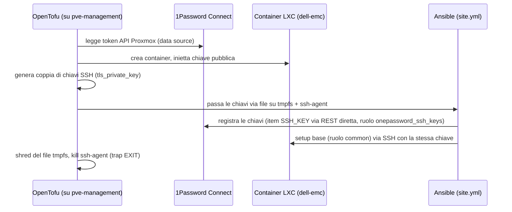

---
aliases:
  - ADR-006
  - 1Password Connect
  - Secret management
tags:
  - adr
  - secrets
  - opentofu
  - ansible
  - region/ditta
  - service/1password
status: accettato
date: 2026-08-10
related:
  - "[[005-topologia-multi-sito]]"
---

# ADR-006: Secret management con 1Password Connect

| | |
|---|---|
| **Stato** | Accettato — in produzione parziale (vedi "Da tenere presente") |
| **Data** | 2026-08-10 |
| **Nodi coinvolti** | `dell-emc` (Connect server + OpenTofu + Ansible girano su `pve-management`) |

## Contesto

La regola d'oro di questo repository è che nessun segreto viva in chiaro nel codice versionato: solo riferimenti risolti a runtime. Con l'avvio del provisioning as-code (OpenTofu + Ansible per i container LXC su `dell-emc`, vedi [ADR-005](005-topologia-multi-sito.md)) il problema smette di essere teorico — ogni `tofu apply` genera davvero una coppia di chiavi SSH nuova per ciascun container, e serve un posto dove farle sopravvivere oltre la singola esecuzione, senza scriverle su disco in chiaro né incollarle a mano da qualche parte.

Il vincolo aggiuntivo, specifico di questo homelab: OpenTofu e Ansible girano entrambi su `pve-management`, una macchina di gestione dentro la VLAN di `dell-emc` — la stessa VLAN che, per [ADR-005](005-topologia-multi-sito.md), è dietro un firewall Cisco gestito da terzi e non sotto il mio controllo diretto. Qualunque cosa esponga porte su quella rete va trattata con più cautela che su una LAN di casa.

## Decisione

**1Password Connect self-hosted** (immagini ufficiali `1password/connect-api` + `1password/connect-sync`) su `pve-management`, via Docker Compose (`/opt/docker-compose/1password-connect/`). Due integrazioni, con responsabilità distinte per non duplicare la stessa scrittura da due posti:

- **OpenTofu legge da 1Password**: il provider `1password/onepassword` (già dichiarato, ora effettivamente usato) espone un `data "onepassword_item"` che recupera il token API di Proxmox da un item nel vault, invece di richiederlo come `-var` digitato a mano ad ogni apply. Override manuale via variabile resta possibile per test, e in quel caso il data source non viene nemmeno interrogato (`count` condizionale).
- **Ansible scrive su 1Password**: subito dopo che OpenTofu genera la coppia di chiavi SSH di un container (`tls_private_key`) e prima che quella chiave esca di scena, il provisioner passa chiave pubblica e privata ad Ansible tramite un file temporaneo su `tmpfs` (`/run`, mai su disco persistente, distrutto con `shred` a fine esecuzione qualunque sia l'esito). Il ruolo `onepassword_ssh_keys` le registra come item categoria **SSH_KEY** nel vault, titolate `<nome-container>-ssh`, chiamando **direttamente la REST API di Connect** (`ansible.builtin.uri`) invece del modulo `generic_item` della collection — vedi "Categorie 1Password usate in questo repository" più sotto per il perché. Se un item con lo stesso titolo esiste già, viene cancellato e ricreato da zero (mai aggiornato sul posto: la categoria è immutabile dopo la creazione, vedi "Da tenere presente").

Perché Ansible e non OpenTofu anche per questa scrittura: il file `inventory.yml` generato da OpenTofu porta già un campo `op_item_title` per ogni host — la convenzione esisteva prima di questo ADR, semplicemente non era ancora collegata a nulla. Aggiungere un secondo punto di scrittura in OpenTofu (un `resource "onepassword_item"`) avrebbe significato due sistemi che scrivono lo stesso dato nello stesso vault, con più superficie per un disallineamento.

Bootstrap del lato Python richiesto dalla collection Ansible (`onepasswordconnectsdk`): **dnf ha sempre la priorità**. Se il pacchetto non è nei repository abilitati (atteso su Rocky/EPEL: è pubblicato solo su PyPI da 1Password), si ripiega su un virtualenv dedicato (`/opt/infrastructure/.venv-1password`, creato e gestito dal modulo `ansible.builtin.pip` con l'opzione `virtualenv`) — mai `pip install` diretto nel Python di sistema, per non rischiare di rompere altri strumenti che dipendono dallo stesso interprete (incluso Ansible stesso).

**Percorso "recovery" per run standalone.** `run.sh` (fuori dal flusso innescato da OpenTofu) non ha mai avuto accesso alla chiave privata dei nodi — quella esiste solo per pochi secondi nell'ssh-agent che gira dentro il `local-exec` di Tofu, poi viene distrutta. Per non dover forzare un `tofu apply -replace=terraform_data.run_ansible` ogni volta che serve solo ripushare un `docker-compose.yml` aggiornato, il ruolo `onepassword_ssh_agent` recupera la chiave da 1Password (dove `onepassword_ssh_keys` l'ha già salvata) e la carica nell'ssh-agent avviato da `run.sh`, usando la stessa convenzione `op_item_title` già in inventory. Attivo solo quando `container_ssh_keys` non è definito (cioè quando non è OpenTofu a invocare il playbook), per non duplicare lavoro sul percorso Tofu-triggered.

## Alternative considerate

| Alternativa | Perché scartata |
|---|---|
| **1Password CLI (`op`) invece di Connect** | Richiederebbe un account/sessione interattiva o un Service Account token con accesso diretto a tutti i vault da ogni macchina che esegue automazione; Connect confina l'accesso a un server dedicato, scopabile per vault tramite il token emesso, e non richiede login interattivo per l'automazione. |
| **Scrivere le chiavi SSH solo tramite OpenTofu (`resource onepassword_item`)** | Scartata per evitare due sistemi che scrivono lo stesso dato (vedi sopra); inoltre lo schema del provider Terraform, alla data di stesura, non espone una categoria SSH_KEY nativa — a differenza della REST API di Connect, che la supporta davvero (vedi sotto). |
| **Modulo `generic_item` della collection `onepassword.connect` per le chiavi SSH** | Scartata: il modulo rifiuta `category: ssh_key` lato client con un errore di validazione proprio, ancora prima di chiamare la REST API — verificato dal vivo (elenco accettato: `login, password, server, database, software_license, secure_note, wireless_router, bank_account, email_account, api_credential, credit_card, membership, passport, outdoor_license, driver_license, identity, reward_program, social_security_number`; `ssh_key` non compare). La REST API di Connect supporta `SSH_KEY` regolarmente. Per non snaturare la categoria (finire con chiavi salvate come `secure_note`, difficili da trovare), il ruolo chiama la REST API direttamente con `ansible.builtin.uri` solo per questo caso; `generic_item`/`item_info` restano in uso ovunque altro (bootstrap, lettura identità Infisical) perché lì funzionano senza problemi. |
| **`pip install --break-system-packages` diretto nel Python di sistema per l'SDK Ansible** | Più semplice ma esattamente il tipo di scorciatoia da evitare su una macchina che fa anche altro: un aggiornamento di sistema o un altro tool che tocca lo stesso site-packages potrebbe rompere silenziosamente l'integrazione, o viceversa. |
| **Nessuna persistenza delle chiavi generate, solo uso ephemeral via ssh-agent** | Era di fatto lo stato precedente a questo ADR: la chiave privata esisteva solo nello state OpenTofu (in chiaro, vedi sotto) e nella memoria di ssh-agent per la durata dell'apply. Sufficiente per far funzionare l'automazione una volta, insufficiente per poterla recuperare in futuro (es. accesso manuale a un container, rotazione). |

## Conseguenze

> [!TIP] Positive
> - Il token API di Proxmox non va più digitato a mano ad ogni `tofu apply`: l'automazione diventa non interattiva e ripetibile.
> - Le chiavi SSH generate per ogni container sono recuperabili da 1Password anche mesi dopo, senza dover rileggere lo state OpenTofu.
> - Nessun pacchetto Python installato fuori dal controllo di dnf o di un virtualenv dedicato e dichiarato.
> - Integrazione verificata end-to-end il 10/08/2026: creazione, lettura e cancellazione di un item reale nel vault `PVE-Automation` tramite lo stesso modulo (`onepassword.connect.generic_item`) e lo stesso virtualenv che userà l'automazione in produzione — non solo "il codice sembra corretto", ma "ha davvero scritto e riletto dal vault".
> - Ruolo `onepassword_ssh_keys` (versione REST-diretta) verificato end-to-end l'11/08/2026 con una vera coppia di chiavi ed25519 generata da `ssh-keygen`: creazione item SSH_KEY con campi `private_key`/`public_key` popolati correttamente, poi ri-eseguito a freddo per verificare il percorso cancella-e-ricrea (id e versione dell'item cambiati, non un aggiornamento in-place) — item di test cancellato subito dopo.

> [!WARNING] Da tenere presente
> - **Risolto (10/08/2026):** il token Connect originario in `/root/.bashrc` non era valido (`401 Invalid token signature`). Riemesso dall'autore da 1Password e verificato end-to-end (creazione + lettura + cancellazione di un item reale nel vault tramite lo stesso modulo Ansible usato in produzione). Vault identificato: **`PVE-Automation`** — il suo id reale va passato come `onepassword_vault_id` (non hardcoded in nessuno script versionato, vedi punto sotto sull'audit pre-pubblicazione). Il token vive ora in `/opt/docker-compose/1password-connect/.env` (`0600`), non più in `.bashrc`: era rimasto lì un token vecchio e diverso da quello valido, fonte diretta della confusione iniziale (due sorgenti dello stesso segreto, una delle due stale). `run.sh` carica quel file automaticamente se `OP_CONNECT_TOKEN` non è già in ambiente.
> - **Trovato e corretto durante la verifica:** `chmod 600` su `1password-credentials.json` (fatto come parte dell'hardening di questo stesso ADR) rompe silenziosamente Connect — il processo `connect-api` gira nel container come utente non privilegiato `opuser` (UID/GID `999`, verificato via i file del volume `op-data`), non come root, quindi un file leggibile solo da root non è leggibile dal container. Errore osservato: `open /home/opuser/1password-credentials.json: permission denied`, superficie in un `500` invece che nel `401` atteso. Permessi corretti: `chown root:999` + `chmod 640` — root può scrivere, il processo Connect può leggere, nessun altro utente locale può leggere.
> - **La porta 8080 di Connect resta esposta su `0.0.0.0`** (tutta la VLAN di `dell-emc`, gestita da terzi, non solo `localhost`), in HTTP semplice, protetta solo dal possesso del token bearer. Nessun processo esterno a `pve-management` ne ha bisogno: andrebbe ribindata a `127.0.0.1:8080:8080` nel `docker-compose.yml`. Non ancora fatto: richiede un riavvio del servizio Connect, va coordinato esplicitamente invece di farlo di sorpresa in mezzo a un'altra modifica (lezione imparata proprio da questo ADR, vedi punto sopra).
> - **`terraform.tfstate` conteneva le chiavi private in chiaro con permessi `644`** (leggibile da qualunque utente locale sulla macchina, non solo root). Corretto: `chmod 600` (qui root è anche l'utente che invoca `tofu`, quindi non c'è il problema di UID incrociati visto sopra per Connect). Correzione strutturale non ancora fatta: nessun backend remoto/cifrato per lo state — resta un limite reale di questa configurazione, accettato per ora vista la scala dell'homelab (singolo apply, singolo amministratore), da rivedere se lo state dovesse contenere segreti di peso maggiore.
> - Versione della collection Ansible `onepassword.connect` fissata a `2.4.0` in `requirements.yml` dopo la prima installazione riuscita (10/08/2026, verificata su `pve-management`).
> - **Documentazione del modulo `item_info` fuorviante su un punto concreto:** il RETURN doc descrive `field` come una struttura con `label`/`value`/`section`/`field_type`, ma nella versione 2.4.0 realmente installata `field` è la stringa del valore stessa, non un dizionario — verificato ispezionando la struttura reale restituita (`field is mapping` → `false`). Il ruolo `onepassword_ssh_agent` usa `fetched.field` direttamente, non `fetched.field.value`. Prima di fidarsi della documentazione di un modulo di terze parti su un dettaglio che conta, conviene verificarlo dal vivo con un task di debug innocuo (chiavi/tipi, mai i valori) invece di dare per buono quanto scritto.
> - Integrazione `run.sh` → 1Password → `ssh-agent` verificata end-to-end l'11/08/2026: chiave recuperata dal vault, caricata in agent, connessione SSH reale a `Docker-100`, deploy di un `docker-compose.yml` aggiornato (`monitoring`, incluso Grafana) senza passare da OpenTofu.
> - Il file `inventory.yml` di Ansible è **generato** da OpenTofu (`local_file.ansible_inventory`) e non viene versionato: la fonte di verità sui container è `variables.tf`, non l'inventory in sé.
> - **Risolto:** bug preesistente, non introdotto da questo ADR — la Fase 2 di `site.yml` puntava a `hosts: pve_100`, che non ha mai avuto un corrispettivo in `inventory.yml` (il gruppo generato da OpenTofu è `docker_nodes`), quindi il deploy dei servizi Docker probabilmente non aveva mai girato per davvero tramite questo playbook. Corretto in `hosts: docker_nodes`.
> - **Categoria immutabile dopo la creazione, verificato dal vivo:** `PATCH .../items/{id}/category` risponde `400 "unsupported action for path"`; un `PUT` con categoria diversa da quella originale non fallisce ma la ignora silenziosamente, l'item resta nella categoria con cui è stato creato. L'unico modo per correggere la categoria di un item esistente è cancellarlo e ricrearlo da zero — è quello che fa il ruolo `onepassword_ssh_keys` (vedi Decisione). Scoperto perché diversi item creati nelle prime iterazioni di questo lavoro erano finiti come `SECURE_NOTE` invece della categoria giusta: corretti tutti con questo stesso procedimento l'11/08/2026.
> - **Gotcha Ansible, non ovvio, trovato durante il test end-to-end dell'11/08/2026:** `| default(omit)` dentro un blocco `vars:` di un task, poi controllato con `is defined` in `when:`, **non funziona come ci si aspetta** — `omit` è un segnaposto valido solo se usato come valore diretto di un parametro di modulo; altrove (incluso dentro `vars:`) si comporta come una stringa qualunque, quindi risulta sempre "defined". Il ruolo `onepassword_ssh_keys` aveva esattamente questo bug nella prima stesura: il task di cancellazione scattava per ogni item anche senza nessun match esistente, fallendo su `.id` perché il valore era una stringa segnaposto e non un dizionario. Trovato al primo run reale (non da lettura del codice), corretto verificando la lunghezza della lista dei match invece di testare `is defined` su un `default(omit)`.
> - **Igiene sul vault, non un bug ma una disciplina da mantenere:** durante le sessioni di test empirico sulle categorie (vedi "Campi di default per categoria" sotto) sono rimasti nel vault 5 item di prova (`claude-probe-*`) che avrebbero dovuto essere cancellati subito dopo l'uso — trovati e rimossi solo durante un audit successivo (11/08/2026). Item di test creati per verificare comportamenti della REST API vanno cancellati nello stesso comando/blocco che li crea, non "alla fine della sessione".
> - **Audit pre-pubblicazione del repo (11/08/2026):** `gitleaks` sull'intera history (14 commit, nessun match) e controllo manuale mirato a quello che un secret scanner non intercetta — IP pubblici, MAC address, coordinate GPS, ID reali non credenziali di per sé. Trovato: l'id reale del vault `PVE-Automation` era hardcoded come default in `infrastructure/ansible/run.sh` e `infrastructure/opentofu/nodes/dell-emc/apply.sh` ("tanto non è un segreto, serve solo il token per usarlo" — vero, ma un repo pubblico non deve pubblicizzare inutilmente l'id di una risorsa di produzione reale). Rimosso: entrambi gli script ora falliscono con un messaggio chiaro se `ONEPASSWORD_VAULT_ID` non è impostato, invece di ripiegare su un default hardcoded.

## Categorie 1Password usate in questo repository

Ogni item pushato su 1Password da questa automazione (o creato a mano per supportarla) usa la categoria che lo rende ritrovabile per tipo, non genericamente "Secure Note" — con l'eccezione dei casi in cui nessuna categoria nativa si adatta davvero (vedi ultima riga). Categoria **immutabile dopo la creazione** (vedi "Da tenere presente"): se un item era nato con la categoria sbagliata, è stato cancellato e ricreato, non aggiornato.

| Item | Categoria | Perché |
|---|---|---|
| `<nome-container>-ssh` (es. `Docker-100-ssh`, `Traefik-110-ssh`) | `SSH_KEY` | Coppia di chiavi SSH generata da OpenTofu per ogni container. Creata via REST diretta (`ansible.builtin.uri`), non `generic_item` (vedi "Alternative considerate"). |
| `Proxmox API Token` | `API_CREDENTIAL` | Token API usato da OpenTofu per autenticarsi a Proxmox. |
| `Infisical Ansible Identity - ansible-automation` | `API_CREDENTIAL` | Credenziali Universal Auth (client_id/client_secret) dell'identità machine che Ansible usa per leggere i secret applicativi da Infisical (vedi ADR-007). |
| `Infisical MCP - claude-code-mcp` | `API_CREDENTIAL` | Stessa logica, identità dedicata al server MCP di Infisical usato in sessione interattiva, ruolo admin invece di member. |
| `PVE-connect Access Token: <ambito>` | `API_CREDENTIAL` | Token di accesso per le varie integrazioni che parlano con Proxmox/pve-management. |
| `Infisical Core - Admin Account` | `LOGIN` | Credenziali dell'account amministratore della UI Infisical — usa i campi nativi `username`/`password` della categoria (vedi "Campi di default" sotto), non campi custom. |
| `Infisical Core - Bootstrap Secrets` | `SECURE_NOTE` | Insieme eterogeneo di segreti di bootstrap (ENCRYPTION_KEY, AUTH_SECRET, POSTGRES_PASSWORD, DB_CONNECTION_URI, REDIS_URL, SITE_URL) — nessuna categoria nativa è pensata per "più segreti sciolti senza struttura login/API", quindi `SECURE_NOTE` con campi custom resta la scelta più onesta, non un ripiego per pigrizia. |
| `PVE-connect Credentials File` | `DOCUMENT` | Il file `1password-credentials.json` stesso (allegato), non un segreto strutturato in campi. |

## Campi di default per categoria (verificato dal vivo)

Non documentato in modo completo nella pagina `add-an-item`/`get-vault-items` della REST API: cosa crea automaticamente Connect quando un item nasce "vuoto" in una data categoria, e quali campi nativi sono effettivamente scrivibili via API invece che solo dall'app 1Password. Verificato con item di prova creati e cancellati subito dopo (vedi "Da tenere presente" sulla disciplina di igiene del vault):

- **LOGIN**: alla creazione "nuda" (nessun campo passato) Connect crea comunque `username` (purpose `USERNAME`), `password` (purpose `PASSWORD`) e `notesPlain` — tutti scrivibili via API normalmente. **Usato**: `Infisical Core - Admin Account` è stato creato inizialmente con campi custom `admin_email`/`admin_password` invece di questi campi nativi (probabilmente perché l'item è stato scritto a mano via `curl` prima di questa indagine); retrofittato l'11/08/2026 spostando i valori nei campi nativi `username`/`password` e rimuovendo i custom — così l'item è riconoscibile e compilabile automaticamente come un vero login, non solo per titolo.
- **SSH_KEY**: alla creazione "nuda" Connect crea solo `notesPlain` — nessun `private_key`/`public_key` nativo precompilato. Si passano entrambi come campi custom (`private_key` tipo `CONCEALED`, `public_key` tipo `STRING`), come fa il ruolo `onepassword_ssh_keys`.
- **API_CREDENTIAL**: alla creazione "nuda" crea solo `notesPlain`. Esistono slot "riservati" per uno username e una password nativi, ma sono **irraggiungibili dalla REST API di Connect**: assegnare esplicitamente `purpose: USERNAME`/`purpose: PASSWORD` a un campo custom fa fallire la richiesta (`406`, "too many 'password'/'username' fields in Apply()"), e le proprietà scorciatoia `username`/`credential` a livello di item vengono accettate (`200`) ma scartate silenziosamente — verificato ispezionando la risposta completa dopo la creazione, il valore non è mai salvato da nessuna parte. Conclusione: i template nativi di questa categoria sono popolabili solo dall'app 1Password, non da Connect. Per questo tutti gli `API_CREDENTIAL` di questo repository (token, client_id/client_secret) usano campi custom, non i presunti campi nativi.
- **PASSWORD**: la creazione richiede un valore password fin da subito — Connect rifiuta con `"Password item requires ps value"` altrimenti. Non usata in questo repository (`API_CREDENTIAL`/`LOGIN` coprono i casi reali).
- **Ipotesi testata e smentita**: che Connect promuova automaticamente un item da `SECURE_NOTE` a `SSH_KEY` riconoscendo una vera chiave OpenSSH nel contenuto. Non succede — un item creato come `SECURE_NOTE` con dentro una chiave `ssh-keygen` reale resta `SECURE_NOTE`, la categoria dipende solo da cosa viene dichiarato alla creazione.

## Riferimenti

- [1Password Connect — documentazione](https://www.1password.dev/connect)
- [Connect REST API — Add an item (categorie disponibili)](https://www.1password.dev/connect/api-reference#add-an-item)
- [Connect REST API — Get vault items](https://www.1password.dev/connect/api-reference/get-vault-items)
- [1Password Terraform provider](https://registry.terraform.io/providers/1Password/onepassword/latest/docs)
- [Collection Ansible `onepassword.connect`](https://github.com/1Password/ansible-onepasswordconnect-collection)
- Configurazione: [`infrastructure/opentofu/nodes/dell-emc/`](../../infrastructure/opentofu/nodes/dell-emc/), [`infrastructure/ansible/`](../../infrastructure/ansible/)
- [ADR-005](005-topologia-multi-sito.md) — vincolo di rete su `dell-emc` che motiva il rebind di Connect a `localhost`
