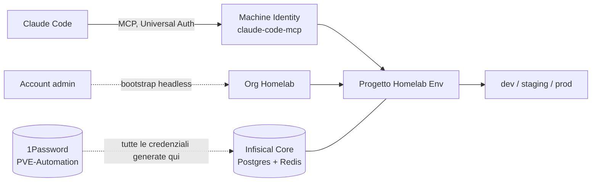

---
aliases:
  - ADR-007
  - Infisical
  - Gestione ENV
tags:
  - adr
  - secrets
  - infisical
  - mcp
  - region/ditta
  - service/infisical
status: accettato
date: 2026-08-11
related:
  - "[[006-1password-connect]]"
---

# ADR-007: Gestione delle variabili d'ambiente con Infisical

| | |
|---|---|
| **Stato** | Accettato — in produzione, scala homelab (non HA) |
| **Data** | 2026-08-11 |
| **Nodi coinvolti** | `dell-emc` (Infisical Core gira su `pve-management`) |

## Contesto

[ADR-006](006-1password-connect.md) risolve la gestione dei segreti *infrastrutturali*: chiavi SSH generate da OpenTofu, token API di Proxmox, credenziali che servono all'automazione (Terraform/Ansible) per funzionare. Non risolve un problema diverso ma altrettanto reale: i **file `.env` dei singoli servizi Docker Compose** (`/opt/docker-compose/<servizio>/.env`) — le variabili d'ambiente applicative di Grafana, Nextcloud, Authentik e via dicendo — restano file sparsi sul filesystem di ogni nodo, senza versioning, senza uno storico di chi ha cambiato cosa, senza un posto solo dove vederli tutti.

1Password Connect avrebbe potuto coprire anche questo caso d'uso (è comunque un secret manager generico), ma il modello a "item" di 1Password è pensato per credenziali singole, non per gestire un intero set di variabili d'ambiente per servizio con lo stesso linguaggio che poi usa Docker Compose (`KEY=VALUE`, per ambiente — dev/staging/prod). Infisical è costruito esplicitamente attorno a questo caso d'uso.

## Decisione

**Infisical Core self-hosted** su `pve-management`, Docker Compose (`/opt/docker-compose/infisical/docker-compose.yml`, dati in `/opt/docker-compose/infisical/data/{postgres,redis}` — bind mount, non volume Docker nominato, per coerenza con la convenzione decisa in questa stessa sessione: tutto lo stato di un servizio vive dentro la sua cartella).

- Immagine **pinnata** a `infisical/infisical:v0.162.18` (il compose file ufficiale di Infisical marca esplicitamente `:latest` come da non usare in produzione).
- Porta host **8090** (non 80, il default upstream, né 8080 — per non avere ambiguità con la porta di 1Password Connect anche se, verificato con `ss -tlnp`, non c'era un conflitto reale a livello di bind: due porte host distinte, nessuna sovrapposizione tecnica. Cambiata comunque su richiesta esplicita, per chiarezza futura).
- **Bootstrap headless**: `infisical bootstrap --domain=... --email=... --password=... --organization=Homelab`, niente form via UI — crea org, utente admin e una Instance Admin Machine Identity in un colpo solo, scriptabile.
- Un progetto (`Homelab Env`, slug `homelab-env`) con gli ambienti di default (dev/staging/prod).
- Una Machine Identity dedicata (`claude-code-mcp`, Universal Auth) con ruolo `admin` sul progetto, usata esclusivamente dal server MCP (`@infisical/mcp`) per far gestire i segreti a Claude Code stesso — non l'identità instance-admin del bootstrap, per non usare una credenziale con privilegi massimi per un caso d'uso più ristretto.
- **MCP configurato a livello *user* di Claude Code** (`claude mcp add -s user`, finisce in `~/.claude.json`), non a livello *project* — il file `.mcp.json` di progetto sarebbe versionato in questo repository pubblico, e non deve mai contenere un client secret in chiaro. Conseguenza pratica: chi vuole usare questa integrazione da un'altra macchina deve rifare il setup lì (non è automatizzato, è un limite noto, vedi sotto).
- **Tutte** le credenziali generate — account admin, `ENCRYPTION_KEY`/`AUTH_SECRET`/password Postgres del bootstrap, client ID/secret della Machine Identity MCP — salvate su 1Password (vault `PVE-Automation`), stesso meccanismo di [ADR-006](006-1password-connect.md).

## Alternative considerate

| Alternativa | Perché scartata |
|---|---|
| **Usare solo 1Password Connect anche per gli `.env` applicativi** | Modello a item singolo, non pensato per un set KEY=VALUE per ambiente; avrebbe richiesto convenzioni artificiali (un item con decine di campi custom) invece di un prodotto già pensato per questo. |
| **Infisical Cloud invece di self-hosted** | Coerente con la scelta già fatta in [ADR-006](006-1password-connect.md) di tenere i segreti sotto controllo diretto, sulla propria infrastruttura, non su un servizio terzo — stesso ragionamento, stessa conclusione. |
| **MCP a livello di progetto (`.mcp.json` versionato)** | Scartato subito: questo repository è pubblico, un client secret — anche solo per errore in un commit futuro — sarebbe un incidente serio. Lo scope *user* tiene il segreto fuori dal repository per costruzione, non per disciplina. |
| **Riusare l'Instance Admin Machine Identity del bootstrap anche per MCP** | Privilegio massimo (equivalente a un root credential) per un client che deve solo leggere/scrivere segreti in un progetto. Identità dedicata con ruolo `admin` di *progetto*, non di istanza. |

## Conseguenze

> [!TIP] Positive
> - Le variabili d'ambiente dei servizi hanno finalmente un posto solo, con storico, invece di file `.env` sparsi senza tracciabilità.
> - Bootstrap completamente scriptabile (CLI, nessuna interazione browser) — ripetibile, documentabile riga per riga.
> - Claude Code può leggere/scrivere segreti in Infisical direttamente via MCP, con un'identità scoped e non con privilegi di instance-admin.

> [!WARNING] Da tenere presente
> - **Due sistemi di secret management attivi in parallelo** (1Password Connect per i segreti infrastrutturali, Infisical per gli `.env` applicativi). Non è un errore — hanno scope diversi — ma è complessità reale da spiegare a chiunque legga questo repository, e un punto da rivalutare se in futuro uno dei due copre bene entrambi i casi d'uso.
> - **Incidente reale durante il setup, corretto sul momento:** il comando `claude mcp get infisical` ha stampato in chiaro il client secret della Machine Identity MCP nella sessione di lavoro. Trattato come compromesso: secret revocato via API, uno nuovo emesso, aggiornati sia 1Password sia la configurazione locale di Claude Code. Lezione: `claude mcp list` mostra lo stato di connessione senza esporre le credenziali, `claude mcp get` no — usare il primo per verifiche di routine.
> - **Deployment Docker Compose, non ad alta disponibilità**: è la stessa limitazione dichiarata dalla documentazione ufficiale di Infisical ("ideal for trying out Infisical, development environments, or small-scale deployments"). Adeguato alla scala di questo homelab, non lo sarebbe per un caso multi-tenant o mission-critical.
> - **Nessun backup automatico** del volume Postgres (`data/postgres/`, bind mount) — un altro elemento della roadmap "Docker Compose versionato e sanitizzato" ancora da coprire per questo come per gli altri servizi.
> - **Aggiornamento 29/08/2026 — SMTP in realtà configurato, correzione della riga precedente**: verificato dal vivo che `docker-compose/infisical/.env` ha tutte le variabili `SMTP_*` necessarie e il flusso "password dimenticata" funziona end-to-end. La riga precedente ("nessun SMTP configurato") era imprecisa.
> - **Il recupero password di Infisical cerca l'utente per `username`, non per `email`**, nonostante l'etichetta del campo in UI dica "email" — scoperto perché l'account admin aveva `username` (`admin@homelab.internal`) diverso dall'email reale dell'autore, e inserire l'email reale falliva silenziosamente ("Failed to find user data" nei log del backend, nessun errore visibile in UI). Narrativa completa dell'incidente in [ADR-009](009-paca.md).
> - **HTTP semplice, non HTTPS**, sulla VLAN di `dell-emc` — stesso limite già accettato e documentato per 1Password Connect in [ADR-006](006-1password-connect.md), stesso ragionamento sul perimetro di rete.
> - Setup MCP non replicato automaticamente su altre macchine: chi vuole usare questa integrazione da un client Claude Code diverso deve ripetere `claude mcp add` a mano con le credenziali lette da 1Password.

## Riferimenti

- [Infisical — documentazione self-hosting](https://infisical.com/docs/self-hosting/overview)
- [Infisical — bootstrapping automatizzato](https://infisical.com/docs/cli/commands/bootstrap)
- [Infisical MCP server](https://infisical.com/docs/mcp)
- Configurazione: [`docker-compose` su `pve-management`, non versionato in questo repo](../../README.md#struttura-del-repository) — vedi roadmap per la sanitizzazione futura
- [ADR-006](006-1password-connect.md) — secret management infrastrutturale, distinzione di scope con questo ADR
