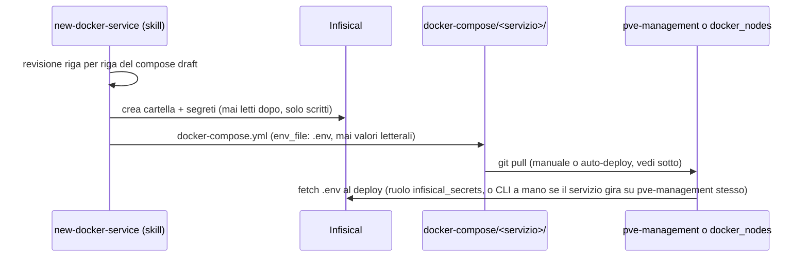

---
aliases:
  - ADR-008
  - Docker Compose management
  - Renovate
  - Auto-deploy
tags:
  - adr
  - docker
  - ci-cd
  - region/ditta
  - service/renovate
status: accettato
date: 2026-08-11
related:
  - "[[002-cloudflare-tunnel]]"
  - "[[006-1password-connect]]"
  - "[[007-infisical-env-management]]"
---

# ADR-008: Versionamento dei docker-compose, aggiornamenti automatici, deploy automatico

| | |
|---|---|
| **Stato** | Accettato — in produzione, con un incidente reale già affrontato (vedi "Da tenere presente") |
| **Data** | 2026-08-11 |
| **Nodi coinvolti** | `dell-emc` (`pve-management`, `Docker-100`, `Traefik-110`) |

## Contesto

I `docker-compose.yml` dei servizi reali sono sempre esistiti solo sugli host, mai nel repository — item esplicito della roadmap ("Docker Compose versionato e sanitizzato per tutti i servizi"), non un semplice dimenticato. Il motivo per cui non erano già versionati non era pigrizia: erano scritti quando serviva, spesso con segreti reali direttamente dentro (vedi l'incidente Semaphore più sotto), senza una convenzione su come tenerli puliti.

Questo ADR copre tre decisioni collegate, prese nello stesso arco di lavoro: **dove** vive la fonte di verità dei `docker-compose.yml`, **come** restano sanitizzati anche quando se ne aggiungono di nuovi, e **come** gli aggiornamenti (immagini, provider, collection Ansible) arrivano dal repository fino ai container reali senza intervento manuale ad ogni passo.

## Decisione

### 1. `docker-compose/` è la fonte di verità, non una copia

Il primo tentativo è stato copiare a mano i file sanitizzati in una cartella `docker/` del repository, separata dalla cartella `docker-compose/` che esiste realmente sull'host (`pve-management`, che è anche il checkout git del repository — vedi [ADR-006](006-1password-connect.md)). Scartato quasi subito: due copie con lo stesso contenuto in due posti diversi dello stesso repository è esattamente il tipo di duplicazione da evitare. `docker/` è stata rinominata `docker-compose/` con `git mv` (storia preservata) e da quel momento si traccia **direttamente** il path reale — build il file lì, `git add`, fatto, nessuna sincronizzazione manuale tra due copie.

`infrastructure/` (la copia di lavoro di `ansible/`+`opentofu/`, con inventory generato e virtualenv) resta invece **non** tracciata per intero: lì dentro non c'è contenuto originale da preservare, solo artefatti di esecuzione.

### 2. Sanitizzazione: revisione riga per riga, poi Infisical fin dall'inizio

Per i servizi già esistenti, ogni `docker-compose.yml` è stato riletto per intero prima di essere versionato, cercando esplicitamente: segreti letterali in `environment:` (da spostare in `env_file: .env`, mai committato), cartelle dati/stato da aggiungere al `.gitignore` (verificato con `git check-ignore -v`, mai assunto), IP/domini hardcoded (privati accettati, pubblici mai), file montati che non sono variabili d'ambiente (da valutare caso per caso).

Per i servizi **nuovi**, invece di sanitizzare a posteriori si è scritta una skill (`.claude/skills/new-docker-service/SKILL.md`) che guida la scrittura del file già nella forma corretta fin dall'inizio: segreti sempre via `env_file: .env`, valori reali sempre provisionati su Infisical (progetto "Homelab Env", una cartella per servizio, ambiente `prod`) prima ancora di scrivere il compose, mai il contrario.

### 3. Renovate self-hosted per gli aggiornamenti

Un container Renovate (`docker-compose/renovate/`) scansiona il repository ogni ora e apre PR su GitHub per le immagini Docker desincronizzate, oltre — bonus non richiesto ma scoperto durante il deploy — alle collection Ansible (`ansible/requirements.yml`) e ai provider OpenTofu (`opentofu/nodes/dell-emc/providers.tf`), rilevati automaticamente dai manager `ansible-galaxy` e `terraform` di Renovate senza nessuna configurazione aggiuntiva.

Renovate self-hosted non ha una modalità daemon nativa (verificato sulla documentazione ufficiale prima di scriverlo, non assunto): ogni invocazione scansiona una volta ed esce. Per restare nello stesso pattern di ogni altro servizio (`docker compose up -d`, nessun cron esterno sull'host) l'entrypoint del container sostituisce l'esecuzione one-shot con un loop minimo (scansiona, aspetta, ripete).

I commit di Renovate usano `RENOVATE_PLATFORM_COMMIT=enabled`: fa creare i commit tramite l'API di GitHub invece che con git in locale nel container, e GitHub li marca automaticamente "Verified" — nessuna chiave GPG/SSH da generare o gestire per un bot.

**Policy di automerge** (dopo l'incidente descritto sotto, non prima):
- Minor/patch: automerge attivo (`ignoreTests: true`, perché questo repository non ha ancora CI — vedi roadmap).
- Major, **e** minor/patch delle immagini stateful (`postgres`, `getmeili/meilisearch`, `redis`, `influxdb`): automerge disattivato, i major restano dietro un click esplicito sulla Dependency Dashboard (`dependencyDashboardApproval`).
- `minimumReleaseAge: 3 days` globale: unico margine reale prima che un aggiornamento venga anche solo proposto, in assenza di una suite di test automatici.

### 4. Deploy automatico: timer systemd, non webhook

Un timer systemd su `pve-management` (`scripts/auto-deploy.sh`, ogni 5 minuti) sincronizza `/opt` con `origin/main` e ridispiega — `docker compose pull && up -d` per i servizi che girano direttamente su quell'host, `./run.sh` (idempotente) per quelli sui nodi remoti. Preferito a un webhook GitHub perché riusa quello che esiste già (git, docker compose, Ansible) senza aprire una nuova rotta pubblica (Traefik + Cloudflare Tunnel + verifica firma) solo per guadagnare qualche minuto di latenza.

Lo script **dispiega quello che è già stato deciso** su GitHub — non giudica se un merge è sicuro. Quella responsabilità resta nella policy di Renovate (punto sopra) e in chi clicca "merge".

## Alternative considerate

| Alternativa | Perché scartata |
|---|---|
| **`docker/` come copia separata, sincronizzata a mano da `docker-compose/`** | Primo tentativo, abbandonato quasi subito: due fonti per lo stesso contenuto, una delle due sarebbe inevitabilmente andata fuori sincrono. |
| **Renovate come GitHub App hosted invece che self-hosted** | Più semplice da attivare, ma questo repository ha già l'infrastruttura per farlo girare in casa (Traefik, Infisical, il pattern `docker-compose/`) — self-hosted resta coerente col resto e non aggiunge una dipendenza esterna per un'automazione che tocca direttamente i servizi di produzione. |
| **Deploy via webhook GitHub invece di polling** | Istantaneo invece di un ritardo massimo di 5 minuti, ma richiede una nuova rotta Traefik + ingress Cloudflare Tunnel + verifica firma (un segreto in più, una superficie esposta in più) — costo non giustificato per un homelab dove qualche minuto di ritardo non è un problema reale. |
| **Automerge di tutto (major compresi) fin da subito** | Era la configurazione iniziale, causa diretta dell'incidente descritto sotto. |

## Conseguenze

> [!TIP] Positive
> - `docker-compose/` è oggi l'unica fonte di verità per 8 servizi (1password-connect, infisical, linkwarden, monitoring, traefik, hawser, Semaphore, renovate), nessuna copia da tenere sincronizzata.
> - Renovate copre bonus anche `ansible-galaxy` e `terraform`, non solo le immagini Docker — scoperto scansionando il repository reale, non pianificato in anticipo.
> - Commit di Renovate verificati ("Verified" su GitHub) senza gestire una chiave di firma per il bot.
> - Deploy automatico end-to-end verificato dal vivo l'11/08/2026: un commit pushato è arrivato su `pve-management` da solo entro 5 minuti, senza intervento manuale — la prima volta che è successo per davvero, non solo in teoria.

> [!WARNING] Da tenere presente
> - **Incidente reale (11/08/2026): `infisical-db` è stato giù in produzione.** Un merge automatico di Renovate (major bump `postgres:14-alpine` -> `postgres:18-alpine` su `infisical`) è stato accettato insieme ad altri 5 senza revisione individuale, e una volta dispiegato `infisical-db` non è più ripartito: `postgres` 18+ richiede che i dati siano già nel formato compatibile con `pg_ctlcluster`, generato solo da un `pg_upgrade` reale — non basta cambiare il tag immagine, e Postgres stesso rifiuta di avviarsi su dati nel formato vecchio invece di corromperli. **Nessuna perdita dati**: l'immagine 18 non è mai arrivata a scrivere nulla, si è fermata al controllo di compatibilità. Rollback a `postgres:14-alpine`, servizio verificato di nuovo `healthy` e raggiungibile end-to-end nel giro di pochi minuti.
>   - `linkwarden` aveva lo stesso bump (`postgres:16-alpine` -> `18-alpine`) nello stesso gruppo di merge ma non ancora dispiegato: revertito preventivamente nel repository prima di rieseguire Ansible, evitando che succedesse la stessa cosa una seconda volta nella stessa sessione.
>   - Revertito per la stessa cautela anche un salto enorme di `meilisearch` (v1.12.8 -> v1.53.0, oltre 40 versioni minor in un colpo solo) arrivato nello stesso merge: nessuna verifica fatta sulla compatibilità del formato indice tra versioni così distanti, meglio prudenza che scoprirlo in produzione una terza volta.
>   - **Fix strutturale, non solo il rollback**: `renovate.json` ora richiede un click esplicito sulla Dependency Dashboard per i major bump di `postgres`/`meilisearch`/`redis`/`influxdb`, e li esclude dall'automerge anche per minor/patch. Non elimina il rischio (un click distratto può fare lo stesso danno), alza la soglia da "automerge di un gruppo di PR" a "decisione deliberata su quella singola immagine".
> - **Incidente separato, trovato mentre si sanitizzava Semaphore**: il suo `docker-compose.yml` reale aveva un token di registrazione runner e un token dell'app Gotify **hardcoded in chiaro** direttamente nell'`environment:` del container, più una password amministratore lasciata al valore di default (`"password"`) mai cambiato. Corretto: i tre valori spostati su Infisical, la password rigenerata (quella vecchia era debole di suo, non aveva senso spostarla e basta in un posto sicuro), i due token esterni mantenuti al valore reale invece di ruotarli alla cieca — ruotarli senza aggiornare anche il sistema esterno (il runner registrato, l'app Gotify) avrebbe rotto il pairing.
> - **`config.json` di Semaphore contiene segreti crittografici reali** generati al primo avvio (`cookie_hash`, `cookie_encryption`, `access_key_encryption`), verificato leggendo solo i nomi delle chiavi, mai i valori, prima di escluderlo dal repository.
> - **I tool MCP di Infisical (`list-secrets`, `get-secret`) restituiscono sempre i valori in chiaro**, mai solo i nomi delle chiavi — non ovvio dal nome del tool. Un `list-secrets` chiamato per verificare l'esistenza di un project id ha esposto per errore il `TUNNEL_TOKEN` reale di Cloudflare nell'output di questa stessa sessione (vedi [ADR-002](002-cloudflare-tunnel.md)). Regola scritta subito dopo, ora nella skill: prima di chiamare questi due tool su un path che potrebbe già contenere segreti reali, chiedersi se serve davvero il valore o solo sapere che una chiave esiste.
> - **`hawser` è un'eccezione deliberata al pattern degli altri servizi**: il ruolo Ansible lo copia da `docker-compose/hawser/` su **ogni** host che riceve Docker (`hosts: all` in `site.yml`), non solo su quelli elencati nella lista `services` per-host di `variables.tf` come tutti gli altri stack — scelta esplicita, non un'incoerenza. Gira anche direttamente su `pve-management` (fuori dalla pipeline Ansible, come 1password-connect/infisical/Semaphore/renovate), con un token generato e provisionato a mano per quell'host specifico.
> - **Nessuna CI in questo repository** (vedi roadmap) — `ignoreTests: true` su Renovate e `minimumReleaseAge: 3 giorni` sono le uniche reti di sicurezza automatiche prima che un aggiornamento minor/patch venga mergiato e dispiegato da solo. Non sostituiscono dei test reali, solo li rimandano.
> - **Il timer di auto-deploy non ha un vero rollback automatico**: se un merge rompe qualcosa, lo script segnala nel journal (`journalctl -u auto-deploy.service`) eventuali container rimasti `unhealthy` dopo il redeploy, ma non ripristina la versione precedente da solo — l'incidente `infisical-db` sopra è stato risolto a mano, non da questo meccanismo (che all'epoca del deploy problematico non esisteva ancora).

## Riferimenti

- [Renovate — documentazione self-hosted](https://docs.renovatebot.com/self-hosted-configuration/)
- [Renovate — configuration options (packageRules, automerge, minimumReleaseAge, platformCommit)](https://docs.renovatebot.com/configuration-options/)
- [Postgres Docker image — note sull'upgrade a 18+](https://github.com/docker-library/postgres/issues/37)
- Configurazione: [`docker-compose/`](../../docker-compose/), [`renovate.json`](../../renovate.json), [`scripts/auto-deploy.sh`](../../scripts/auto-deploy.sh), [`.claude/skills/new-docker-service/`](../../.claude/skills/new-docker-service/)
- [ADR-006](006-1password-connect.md) — perché `pve-management` è anche il checkout git di questo repository
- [ADR-007](007-infisical-env-management.md) — convenzioni delle cartelle Infisical usate da questo ADR
- [ADR-002](002-cloudflare-tunnel.md) — l'incidente di esposizione del `TUNNEL_TOKEN` tramite i tool MCP di Infisical
